# MRAnalytics Departments

Operations platform for short-term rental apartment teams.

Built for fast daily execution from mobile, notebook, and desktop, with a strong focus on operational control and traceability.

## Live

- Production: [https://mradep.vercel.app](https://mradep.vercel.app)

## What the software does

- Unit operational states: cleaning, maintenance, inspection, ready, blocked.
- Ticket and task workflows with priority and due dates.
- Check-in risk view to detect issues before guest arrival.
- Reservation operations (manual/CSV) with guest and co-occupant records.
- Evidence management (photos + records) for audit trails.
- SLA and internal alerts for supervisors.

## Product preview

### Desktop
<a href="./public/screenshots/dashboard-operacion.png">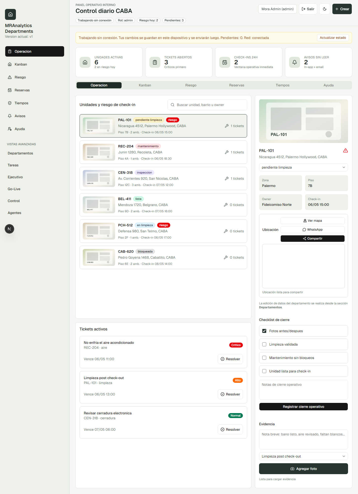</a>
<a href="./public/screenshots/riesgo-checkin.png">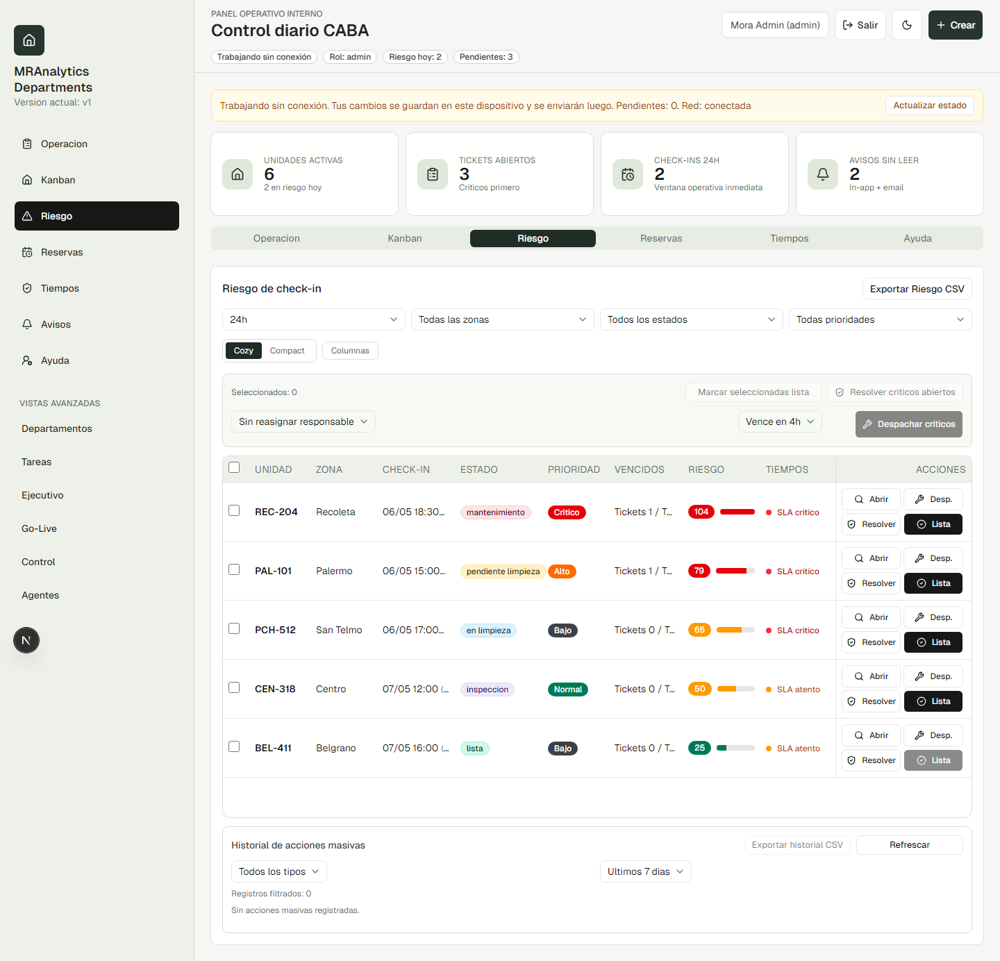</a>
<a href="./public/screenshots/reservas-calendario.png">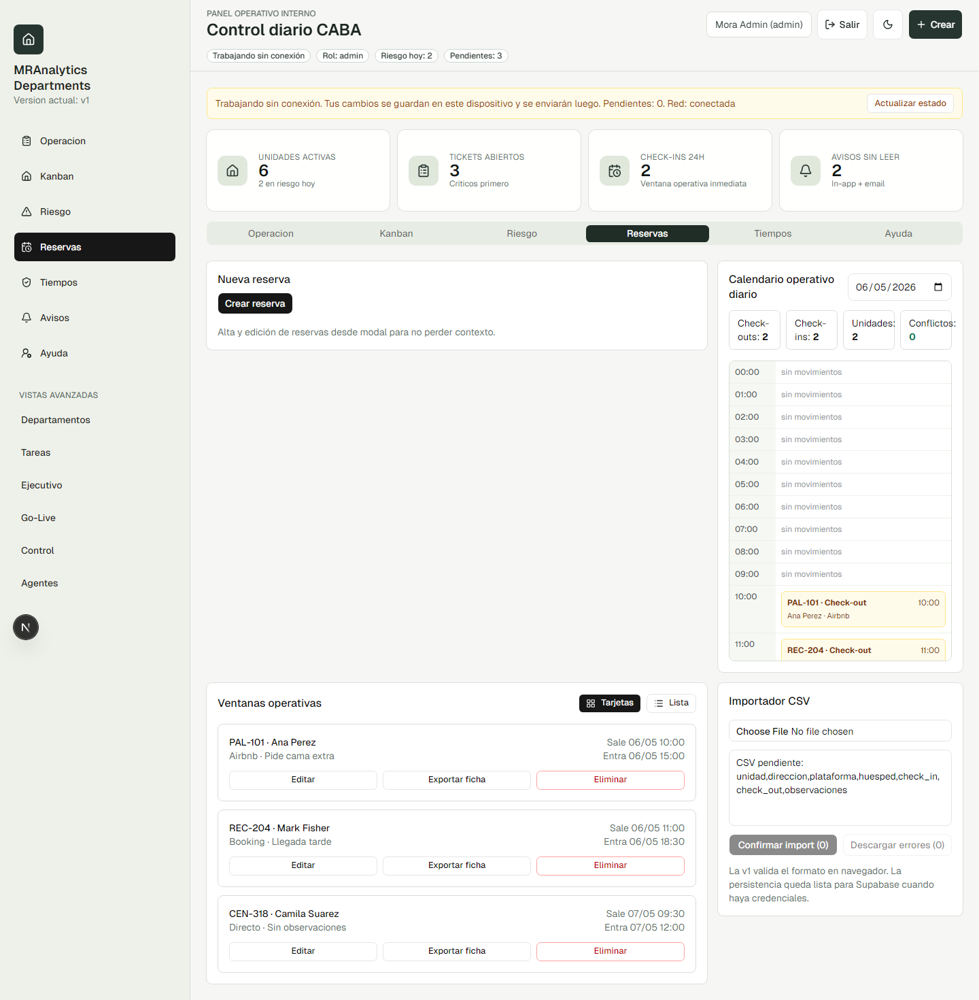</a>
<a href="./public/screenshots/sla-board.png">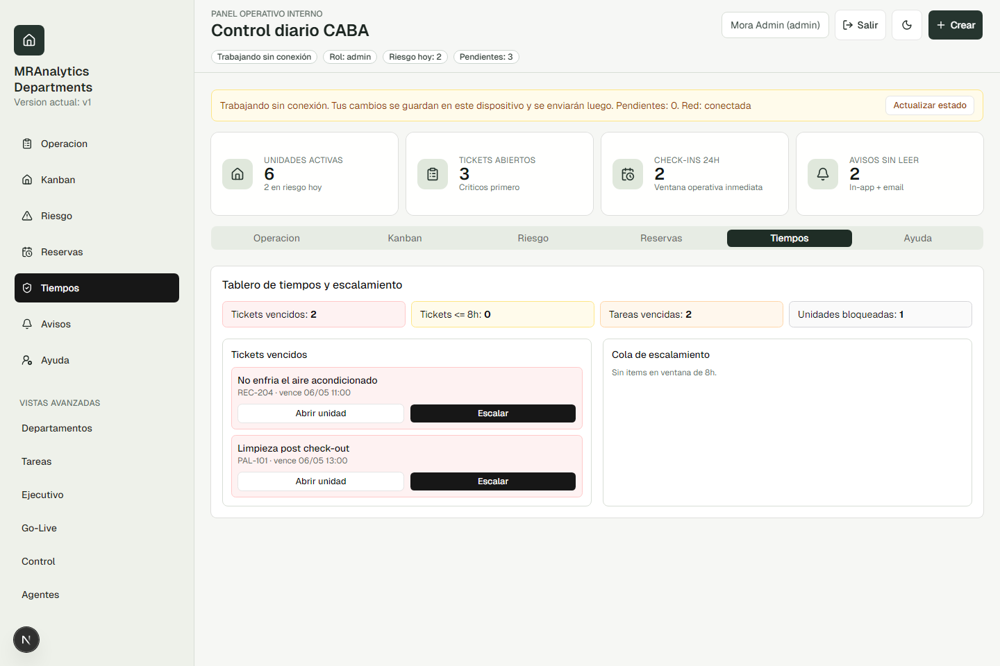</a>
<a href="./public/screenshots/desktop-ayuda.png">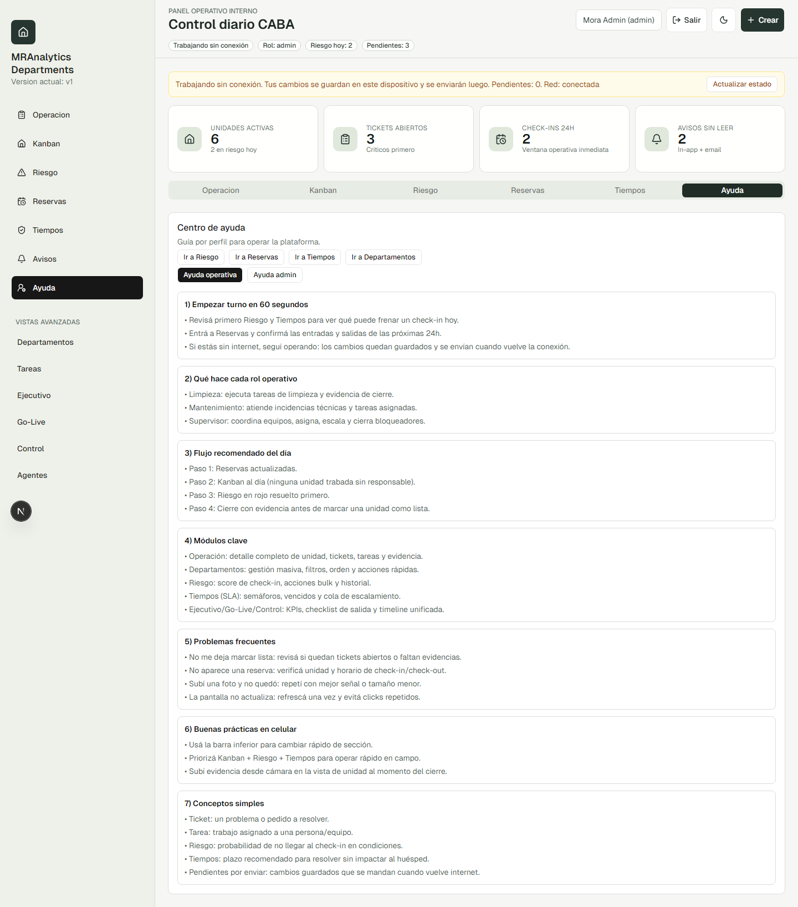</a>
<a href="./public/screenshots/desktop-departamentos.png">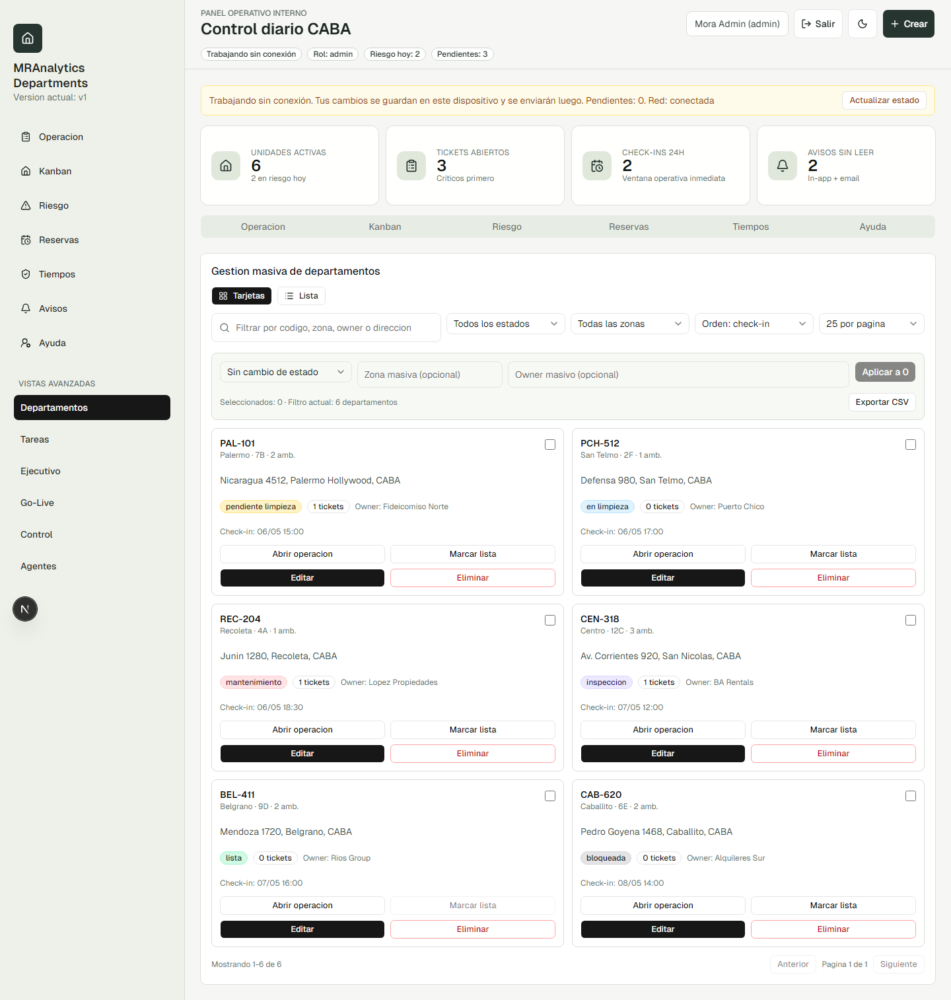</a>

### Mobile

  <a href="./public/screenshots/mobile-operacion.png">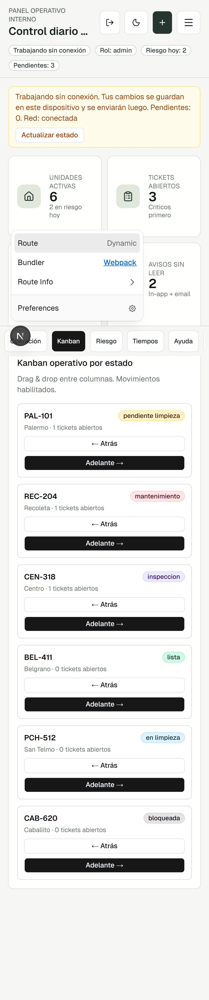</a>
  <a href="./public/screenshots/mobile-riesgo.png">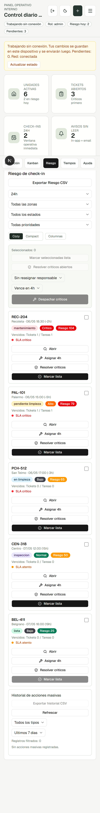</a>
  <a href="./public/screenshots/mobile-reservas.png">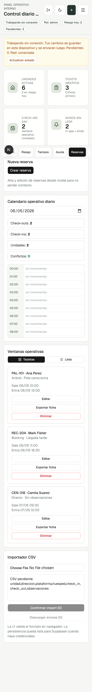</a>
  <a href="./public/screenshots/mobile-ayuda.png">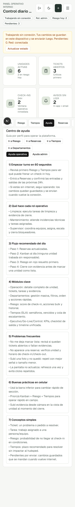</a>
  <a href="./public/screenshots/kanban-mobile.png">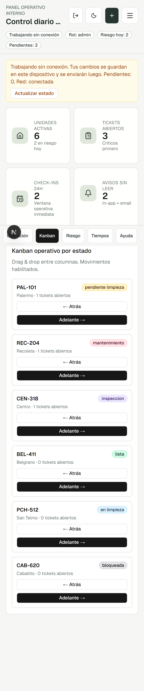</a>

### Theme (Dark)
<a href="./public/screenshots/dashboard-operacion-dark.png">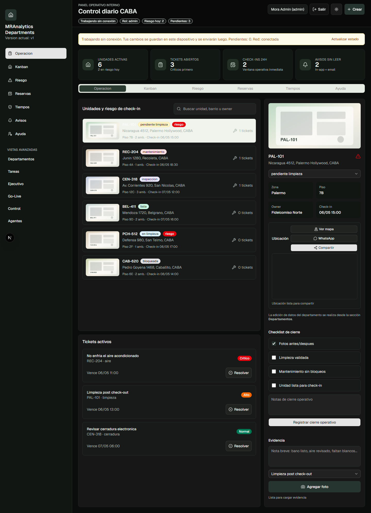</a>
<a href="./public/screenshots/riesgo-checkin-dark.png">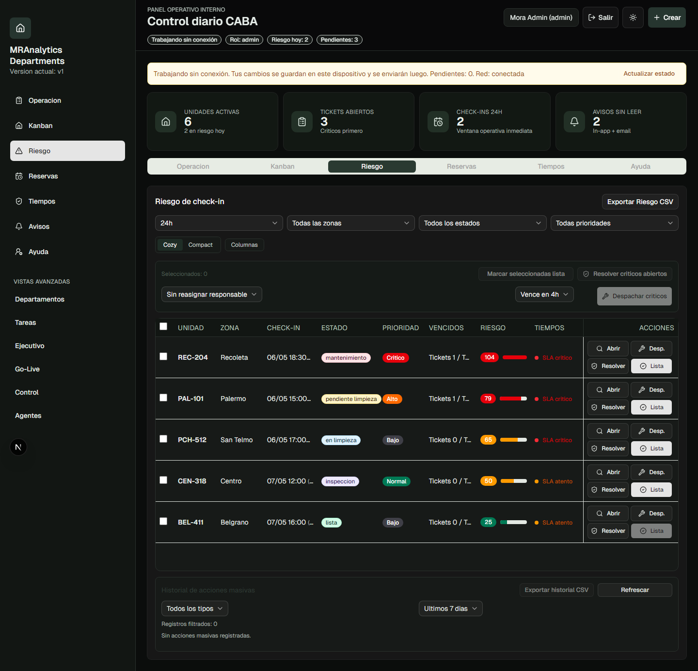</a>

## Current status

**Status:** `v1 internal operations ready`  
**Maturity:** `usable in day-to-day operations`  
**Current focus:** `stability, UX, production hardening`

### Included today

- Core unit operations workflow.
- Ticket and task lifecycle.
- Check-in risk monitoring.
- Reservations with guest profile records.
- Evidence and internal alerting.
- Responsive UX for phone, notebook, and desktop.

### In progress (next versions)

- Advanced supervisor automation.
- External operational integrations.
- Assisted operational intelligence modules.

## Ideal users

- Short-term rental operators.
- Cleaning and maintenance teams.
- Supervisors running high unit volumes.

## Brand

**MRAnalytics**  
**Departments**

## License

This repository is public and source-available.

- Non-commercial use: allowed under [`LICENSE`](./LICENSE).
- Commercial/production use: requires a paid license (see [`COMMERCIAL_LICENSE.md`](./COMMERCIAL_LICENSE.md)).
